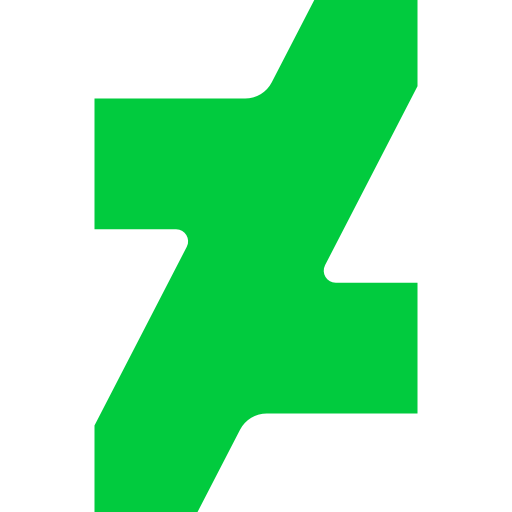

<!-- :copyright: Created/Designed By Samyak Bumb -->

<!-- Start -->

# जय जिनेन्द्र, **My Name is Samyak Bumb** :india:

I Have Published More Than **170+** :partying_face: Projects

<!-- Learned Languages -->
Skills :bulb: :- _HTML_ / _Pug_ / _Markdown_ / _Css_ / _Scss_ / _Less_ / _JavaScript_ / _JSON_ / _Python_ / _AHK_ / _Batch_ / _PowerShell_ / _VBScript_ / _Registry_ / _Git_ / _GDScript_

<!-- About Me -->
- :heart_eyes: I’m Currently Working on : Trying To Be Sober :lotus_position: [:innocent:](https://github.com/Samyak-Bumb/Scret/blob/Samyak/abcr.txt)
- :neutral_face: I’m Currently Learning : **Hacking in 5 Minutes**
- :email: How to Reach Me : **bumbsamyak07@gmail.com**
- :medal_military: **Fun Fact**: I have Created My Own **VS Code Theme** (2K+ Downloads) :- **[Samyak Bumb Theme](https://marketplace.visualstudio.com/items?itemName=SamyakBumb.samyak "VS Code MarketPlace")**

<!-- Social Life -->
## Social Links :moneybag::heavy_dollar_sign::moneybag:

    

## 👑 Hall of fame

<!-- Most Langauge Used -->

<!-- GitHub Stats -->

<!-- Theme -->

<!-- Back to Top -->
  
<b><a href="#">:arrow_up: Back To Top</a></b>

<!-- End -->
