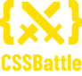

<!-- :copyright: Created/Designed By Samyak Bumb -->

<!-- Start -->

# Hello World, **My Name is Samyak Bumb** :india:

I Have Made More Than **140+** :partying_face: Projects

<!-- Learned Languages -->

Skills :bulb: :- _HTML_ / _Pug_ / _Markdown_ / _CSS_ / _Scss_ / _Less_ / _JavaScript_ / _JSON_ / _Python_ / _AHK_ / _Batch_ / _PowerShell_ / _VBScript_ / _Registry_

<!-- About Me -->

- :star_struck: I’m currently Working on: **Full-Stack Web Development**
- :neutral_face: I’m currently Learning: **Competitive Programming**
- :email: How to Reach Me: **bumbsamyak07@gmail.com**
- :medal_military: **Fun Fact**: I have Created My **Own VS Code Theme**. Name:- **[Samyak Bumb Theme](https://marketplace.visualstudio.com/items?itemName=SamyakBumb.samyak "VS Code MarketPlace")**

## Social Links :moneybag::heavy_dollar_sign::moneybag:

   

## :zap: Samyak's GitHub Stats

<!-- Most Langauge Used -->
<td style="border: none !important"></td>
       
<!-- GitHub Stats -->
<td style="border: none !important"></td>  
<!-- Back to Top -->
  
<b><a href="# Hello World">:arrow_up: Back To Top</a></b>

<!-- End -->
